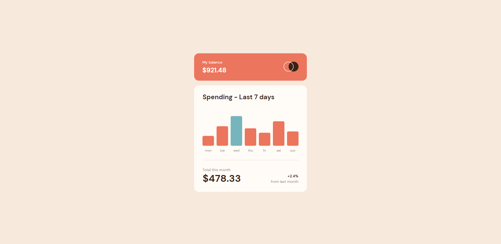

# Expenses Chart Web Component by Jeff Lang

This is a solution to the [Expenses chart component challenge on Frontend Mentor](https://www.frontendmentor.io/challenges/expenses-chart-component-e7yJBUdjwt).

Time to complete: 10 hrs 5 min

## Table of contents

- [Overview](#overview)
  - [The challenge](#the-challenge)
  - [Screenshot](#screenshot)
  - [Links](#links)
- [My process](#my-process)
  - [Built with](#built-with)
  - [How I started](#how-i-started)
  - [What I learned](#what-i-learned)
  - [Continued development](#continued-development)
  - [Useful resources](#useful-resources)
- [Author](#author)

## Overview

### The challenge

Users should be able to:

- View the bar chart and hover over the individual bars to see the correct amounts for each day
- See the current day’s bar highlighted in a different colour to the other bars
- Use the JSON data file provided to dynamically size the bars on the chart

### Screenshot



### Links

- Solution URL: [Front End Mentor Solution URL](https://www.frontendmentor.io/solutions/dynamic-expenses-chart-using-json-data-file-_57MmwKdxI)
- Live Site URL: [jefflangtech.github.io/expense-chart/](https://jefflangtech.github.io/expense-chart/)

## My process

### Built with

- Semantic HTML5 markup
- CSS Grid
- Good ol' vanilla JS
- [Node.js](https://nodejs.org/en/)
- [Express](http://expressjs.com/)

### How I Started

I knew I wanted to create a dynamic component using JSON data, so I had to figure that out first. I wanted simple--just read from the file. To do that I needed a development web server and the quickest and easiest way for me was to setup node.js with express. I then used an app.js file to set the path for my static file resources and send the index.html file upon request (the app.js file is included in my github repo for reference).

Everything still works upon pushing the files to a pages Github repo and that was my overall goal with this project.

### What I learned

I had seen websites where the bar chart loaded dynamically and the bars were animated as they increased in height to their final value and I wanted to do that with this challenge. I achieved that by assigning default values for height to the bars, and a default value of $0.00 to the label, which were both changed when the data was loaded via JS.

Below is an example chart with one column. The div with class of "exp-col" is the bar:

```html
<section id="chart">
  <div class="exp-col">
    <div class="col-label hidden">$0.00</div>
  </div>
  <div class="weekday">sun</div>
</section>
```
```css
.exp-col {
  position: relative;
  min-height: 0.1rem;
  width: 100%;
  background-color: #EC755D;
  border-radius: 0.35rem;
  cursor: pointer;
  transition: min-height 0.5s ease-in;
}
```

A couple of notes on the JS:
- weeklySpend is an array of just the amounts pulled from the JSON so that the maxSpend can be determined, and that array can be looped over to calculated column height
- maxColHeight is determined by the height of the chart less the height of the column label

```js
const maxSpend = Math.max(...weeklySpend)
weeklySpend.forEach(spend => {
  expenseColumns[counter].style.minHeight = 
  Math.floor(spend / maxSpend * maxColHeight) + "px"
})
```

### Continued development

- Media queries and identifying break points went better with this project. I would like to be able to better identify what needs to happen with the layouts, especially for mobile devices.
- I feel like my JS is a bit hacky, especially with determining and setting the column heights, so I should probably do some refactoring of that code in the future.

### Useful resources

- [Kevin Powell: Get started with grid](https://youtu.be/8QSqwbSztnA) - This was my first real attempt at grid so I knew I wanted to review before coding. Kevin Powell has been one of the most valuable resources for implementing good CSS and layouts. This video is just 10 minutes long and goes over the basics, and it links to a much longer video for more in depth grid techniques.

## Author

- LinkedIn - [Jeff Lang](https://www.linkedin.com/in/jeff-lang-a28b4288/)
- Website - [Jeff Lang](https://jefflangtech.github.io/)
- Frontend Mentor - [@jefflangtech](https://www.frontendmentor.io/profile/jefflangtech)
- Twitter - [@jefflangtech](https://twitter.com/jefflangtech)
